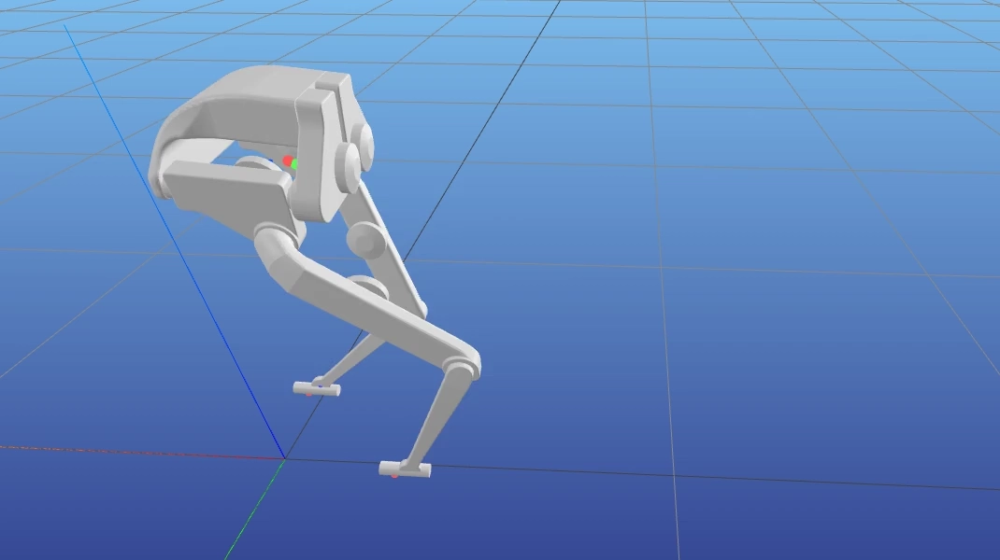
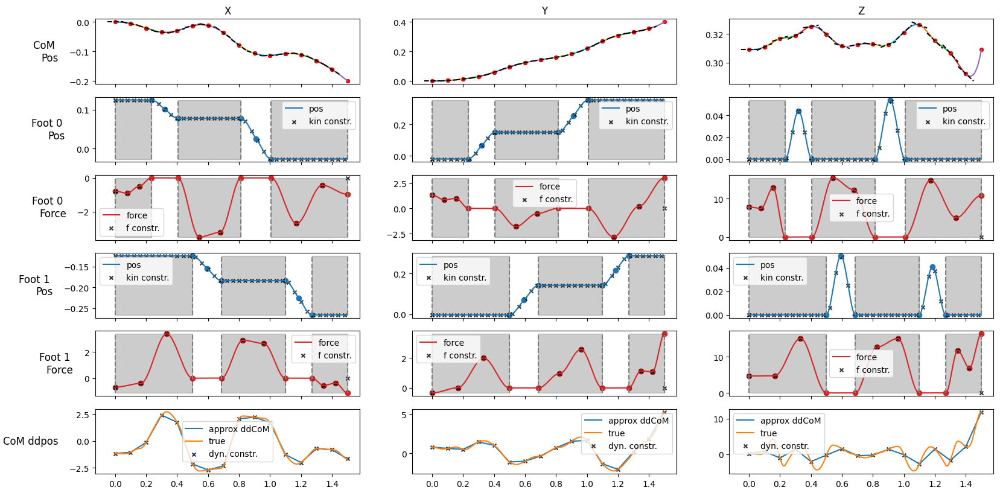

# Bipedal Locomotion Trajectory Optimization


This library is an adapted reimplementation of [Towr](https://github.com/ethz-adrl/towr) (see the paper ["Gait and Trajectory Optimization for Legged Systems Through Phase-Based End-Effector Parameterization"](https://ieeexplore.ieee.org/document/8283570)) with the focus of bipeds.
Thereby spline-based walking motions can be optimized considering the Single Rigid Body Model. 
The step timing is optimized jointly with the stepping behaviour.

We base our implementation on [Casadi](https://web.casadi.org/), which allows for automatic differentiation of constraints. 
This way, additional constraints can be easily added without the need of manually defining Jacobians.
We add additional constrains for motion smoothness and for limiting accelerations.
Furthermore, we allow to enforce periodicity of optimized trajectories, which produces perfectly looping motions.
For dataset generation, optimized motions parameters can be serialized to yaml files.

The primary focus if this library is to generate smooth reference locomotion datasets which can be used in downstream learning tasks (such as RL with imitation learning).


## Trajectory Optimization Combined with IK
The optimized motions can be converted with inverse kinematics to joint trajectories.
In the following we show an example of the Bolt bipedal robot walking backwards, 
where we visualize the IK joint trajectory of the motions optimized with this library.



## Usage
Run the biped example application:
```bash
uv sync
uv run examples/biped_collocation_optimal_config.py
```

Minimal example usage:
```python
opti = CentroidalDynPolyOpti(
    mass=5, # kg
    InertiaMatrix=np.array(...),
    foot_force_max_z=1000, # newton
    # feet have to stay in this range relative to the body
    foot_kin_constraint_box_center_rel=np.array(...),
    foot_kin_constraint_box_size=np.array(...),
    
    # duration of optimized motion
    total_duration=3, # seconds
    
    # gait phases 
    num_phases=5,
    feet_first_phase_type=[PhaseType.CONTACT, PhaseType.FLIGHT],
    
    # spline resolution (duration of each spline for the base motion)
    base_poly_duration=0.1, # seconds
)

# solve with params
opti.solve_opti(
    start_com_pos=np.array(...),
    start_feet_pos=np.array(...),
    end_com_pos=np.array(...),
    
    # initialization of the optimization
    init_gait_type=INIT_GAIT_TYPE.ALTERNATING_SINGLE_FOOT_FLIGHT 
)

# display the result
opti.plot_animate_all()
```

### Solution Visualization
The optimized solution is visualized as motions and forces over time for the base and all feet, see the following plot:
